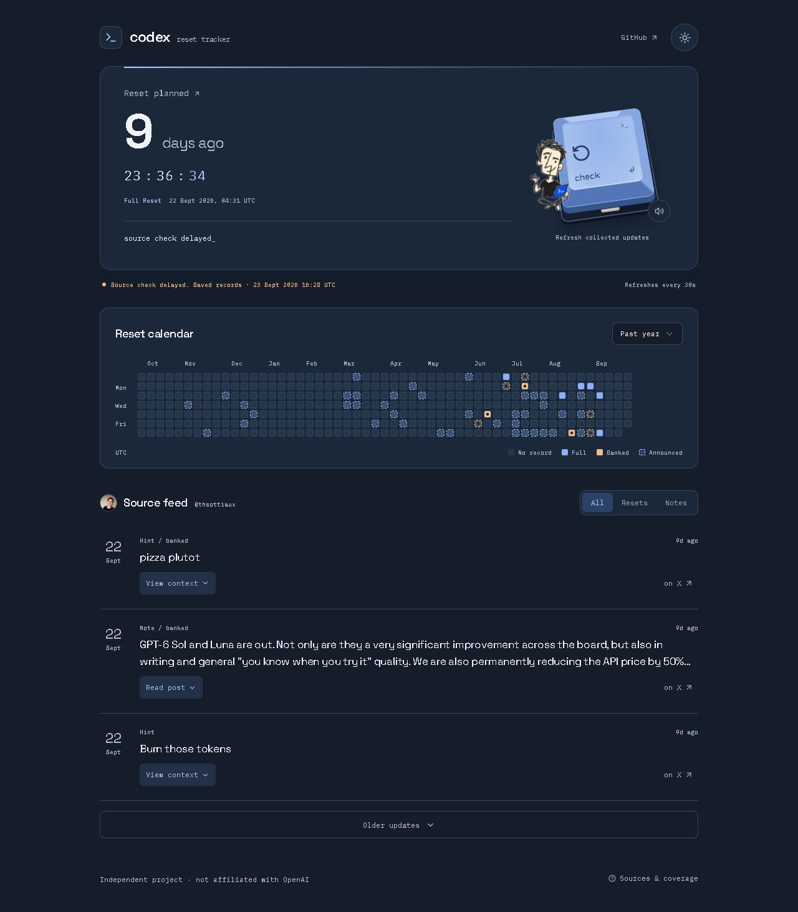

# Codex Reset Tracker

Public Codex reset updates, with the source attached. Follow full and banked resets, read the replies behind them, and see when the collector last checked.

[Open the tracker](https://lolstar123.github.io/codex-reset-tracker/) · [Collection runs](https://github.com/LolStar123/codex-reset-tracker/actions/workflows/collect.yml) · [Hosting & maintenance](GITHUB.md)



*A recorded-source view. The source timestamp and collection timestamp are separate; the screenshot is not a claim of current delivery.*

## Try it

- Press the mechanical **check** key to retrieve the latest shared snapshot. Sound is optional and only plays after a gesture.
- Select a calendar day to filter its source records. Change the year to explore older records; scroll horizontally on smaller screens.
- Switch between **All**, **Resets** and **Notes**. Expand a post for reply context, exact time and coverage warnings, or open its original X source.
- Use **Sources & coverage** for provenance and limits. Theme and sound preferences stay in your browser.

The clock measures time since the newest relevant source update, which can be a delivery report, planned reset, announcement or timing revision. Its label identifies which. Calendar cells distinguish full and banked resets, with a dashed marker for rollout announcements. A future promise never becomes a delivered reset just because its date passes.

## Run locally

Use **Node.js 24 and npm**, matching both GitHub workflows and the collector bundle target. No X account or API key is needed for the public frontend.

```sh
git clone https://github.com/LolStar123/codex-reset-tracker.git
cd codex-reset-tracker
npm run install:ci
npm run dev:pages
```

Open the URL printed by Vite, including `/codex-reset-tracker/`. This development frontend reads the public `monitor-data` snapshot; it does not run upstream collection on your computer. The checked-in bootstrap snapshot is shown first and retained if the shared feed is unavailable.

For a production preview:

```sh
npm run build:pages
npm run preview:pages
```

`install:ci` wraps `npm ci` with the required development and optional packages and checks that the local Vinext executable exists. The lockfile is committed. GitHub uses ordinary `npm ci --no-audit --no-fund`; neither installer creates a background task.

On Windows, stop local Vite preview/dev processes before reinstalling: they can hold native dependency files open and cause an `EPERM` install failure.

## Check changes

```sh
npm run test:github
npx tsc --noEmit
npm run build:pages
npm run build:collector
```

These checks use deterministic fixtures and build locally. They do not trigger remote collection. Regression cases cover reply context, classification, changed promises, announcement versus delivery, duplicate records, retained history, failed sources and stale snapshot ordering.

For UI changes, inspect desktop and mobile renders, calendar/date filters, source context, keyboard activation, failed refresh recovery and reduced motion. The original `tests/*-qa.js` files include historical local-server selectors; use the current Pages route and controls rather than assuming those scripts remain drop-in browser tests.

## Collection and hosting

**React 19 · TypeScript · Vite · GitHub Actions · GitHub Pages**

The collector retrieves @thsottiaux's public posts and replies through FxEmbed, retrieves available parent context, classifies reset wording and reconciles retained history. It also attempts the supplementary Codex Resets archive; that endpoint has returned HTTP 403, recorded separately from timeline failures.

| Process | Behaviour |
| --- | --- |
| `.github/workflows/collect.yml` | Requests collection every five minutes, on relevant code changes, or by manual workflow dispatch. GitHub schedules are best effort. |
| `monitor-data` branch | Stores `snapshot.json`, retained `raw-posts.json` and bounded `runs.json` health receipts. A failed source check preserves the previous records. |
| `.github/workflows/pages.yml` | Tests and builds the frontend, then publishes `dist-pages/` to GitHub Pages. |
| Open browser | Reads the shared snapshot every 30 seconds while visible. Check fetches it immediately; it does not start an upstream source run. |

For your own fork, enable Pages with **GitHub Actions** as its source and create a `monitor-data` branch containing the three state files before enabling collection. `snapshot.json` must be a valid `Snapshot`; `raw-posts.json` and `runs.json` are JSON arrays. The collector deliberately refuses missing/corrupt state. `GITHUB_REPOSITORY` selects your repository at build time, and `PAGES_BASE` can override the asset path. See [GITHUB.md](GITHUB.md) for operational checks and recovery.

For a new state branch, copy `data/bootstrap.json` as `snapshot.json` and initialise `raw-posts.json` and `runs.json` with `[]`. For a migration, copy the existing state instead so its retained records and receipts survive.

Local collector debugging requires Node 24, `dist-collector/collect.mjs` and a state directory with those three files. `node dist-collector/collect.mjs state` makes real upstream requests and updates that directory once. It exits without scheduling itself. Use fixtures for routine verification.

## Code map

| Path | Responsibility |
| --- | --- |
| `pages/main.tsx`, `vite.pages.config.ts` | Public frontend entry, repository base path and shared snapshot endpoint. |
| `app/monitor.tsx`, `app/personality.css` | Monitor state, refresh/polling, filters, responsive layout and theme tokens. |
| `components/reset-{clocks,brief,key}.tsx` | Elapsed update clock, source-derived outlook and mechanical check control. |
| `components/rare-ui/github-activity.tsx` | Accessible calendar fork, source labels and date selection. |
| `lib/collector.ts`, `lib/classify.ts` | Public source transport, reply context and deterministic wording rules. |
| `lib/github-collection.ts`, `lib/archive.ts`, `lib/browser-refresh.ts` | Collection reconciliation, archive events and newer-snapshot protection. |
| `scripts/github-collect.ts`, `data/` | State-file collector and checked-in bootstrap/history/overrides. |
| `tests/`, `DESIGN.md`, `ASSETS.md` | Regression fixtures, design decisions and asset credits. |

The original Sites/D1 server (`npm run dev`, `npm run build`), Cloudflare scheduler and Windows PC helpers remain as alternative deployment code. They are separate from the public Pages route. PC helpers require Windows, Python with `pythonw.exe`, a configured private endpoint and a per-user encrypted credential; do not run their installer to start this frontend. Historical deployment notes are in [MONITORING.md](MONITORING.md) and [MAINTENANCE.md](MAINTENANCE.md).

## Sources and boundaries

This is an independent project, not affiliated with OpenAI. It tracks public reports, not your account balance or private reset telemetry. Source coverage, earlier reply history, mirror caching and GitHub scheduling can leave gaps. Empty calendar days mean **no recorded reset**.

[FxEmbed](https://docs.fxembed.com/api/introduction/) supplies public posts; [Codex Resets](https://codex-resets.com/) supplies attributed historical records. The calendar derives from Rare UI under [MIT](components/rare-ui/LICENSE). Self-hosted fonts, unofficial artwork and recorded keyboard audio are documented in [ASSETS.md](ASSETS.md).
